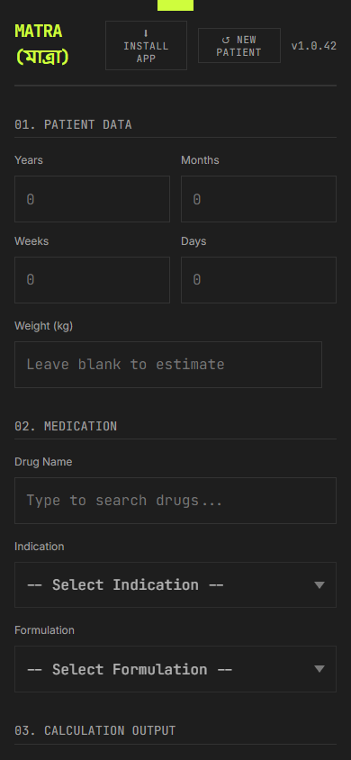
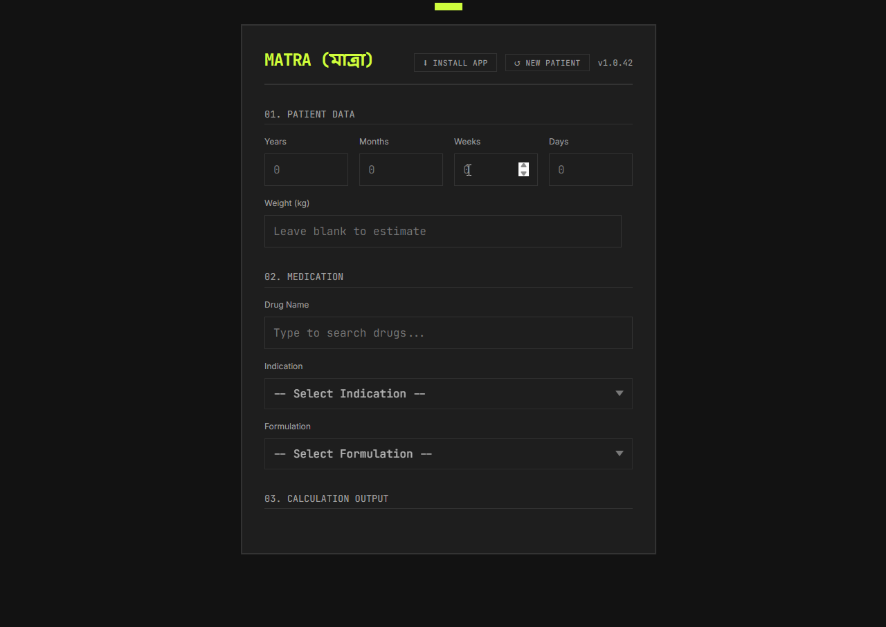

  

<h1 align="center">MATRA (মাত্রা)</h1>

<em>High-precision paediatric dose calculator for clinical professionals</em>

  
  &nbsp;&nbsp;
  

---

## What is Matra?

Matra is a fast, offline-capable web app built for **doctors, residents, and medical students in Bangladesh** who need accurate paediatric drug doses at the point of care — no internet required, no app store needed.

> **Built for the ward. Works on your phone. No login. No ads. No nonsense.**

---

## Features

### Dose Calculation
- Enter patient age (years / months / weeks / days) and weight
- **Auto-estimates weight** using APLS formula if not entered — shown as a badge so you always know
- Calculates dose per indication, with frequency-aware daily dose splitting
- **Automatic dose capping** at max single dose and max daily dose — flagged with a warning
- Results shown as precise volume (ml) **and** practical teaspoon fractions (½ TSF, 1¼ TSF, etc.) for real-world dispensing

### Drug Database
- Searchable by **generic name or brand name**
- Each drug includes multiple indications, formulations (syrup, suspension, tablet, drops, injection, and more), and concentration data
- Brands available in the **Bangladesh market** listed with strength and price
- Clinical notes per drug (e.g. "take after food", "avoid in G6PD deficiency")

### Safety Guardrails
- Age range validation — warns if the patient is too young or too old for the selected drug
- Dose capping with clear on-screen warning
- One-time clinical disclaimer on first use

### Offline First
- Installs as a **Progressive Web App (PWA)** — works fully offline after first load
- Drug database cached locally via Service Worker
- Offline mode banner shown when using cached data

### Usability
- Keyboard-navigable drug search with arrow keys
- Auto-advances between age fields as you type
- **Copy prescription** button — copies drug, formulation, dose, frequency, and indication as a single line, ready to paste anywhere
- New Patient button clears all fields instantly

---

## How to Use

1. **Open** the app in your browser
2. **Accept** the one-time clinical disclaimer
3. Enter the patient's **age** and **weight** (weight optional — will be estimated)
4. **Search** for the drug by generic or brand name
5. Select the **indication** and **formulation**
6. Read the **calculated dose** — practical volume + teaspoon equivalent shown immediately
7. Tap **Copy Prescription** to copy the result to clipboard

---

## Install as an App

**Android (Chrome / Brave):** Tap the browser menu → *Add to Home Screen* or tap the **Install App** button when it appears.

**iOS (Safari):** Tap the Share button → *Add to Home Screen*.

Once installed, Matra runs standalone — no browser chrome, no internet needed.

---

## Important

Matra is a **clinical decision support tool**. All doses must be verified against current guidelines. Clinical judgement always takes precedence. The developer accepts no liability for prescribing decisions.

---

  Built with care for clinicians in Bangladesh &nbsp;·&nbsp; <strong>v1.0.42</strong>

